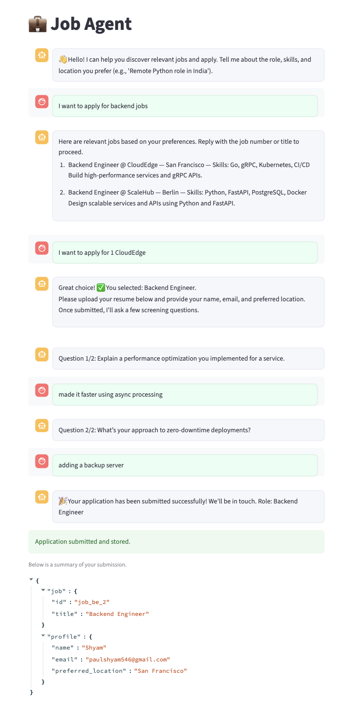
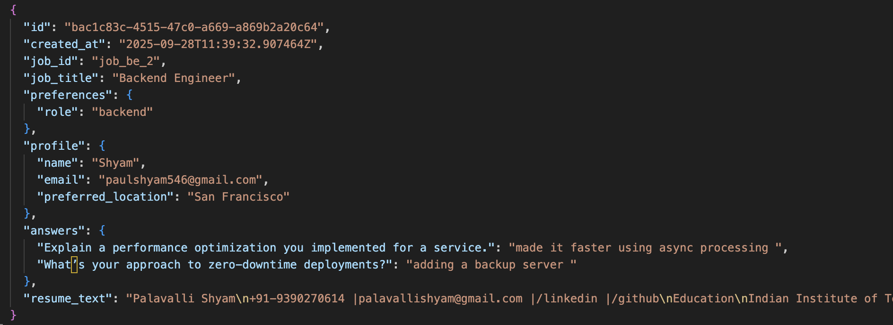
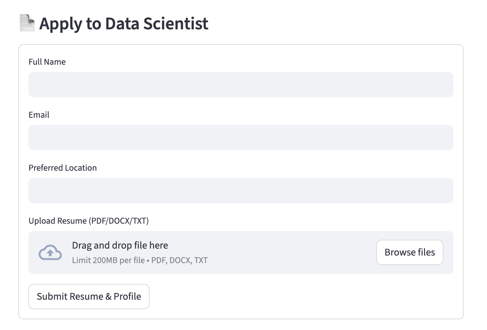

## Job Agent

Simple conversational job assistant that helps candidates discover jobs, upload a resume, answer screening questions, and stores applications.

### Screenshots

#### Chatbot UI


#### Application JSON Example


#### Data Collection Form


### Quick Start (uv)

Requirements: Python 3.10+, `uv` installed.

```bash
cd job-agent
# Create and activate a virtual environment
uv venv .venv
source .venv/bin/activate

# Install dependencies from pyproject.toml / uv.lock
uv sync

export GROQ_API_KEY="YOUR_GROQ_API_KEY"
export HUGGINGFACEHUB_API_TOKEN="YOUR_HF_TOKEN"


streamlit run main.py
```

Notes:
- Edit `data/jobs.json` to change the job catalog.
- Applications are saved to `data/applications.json`.

